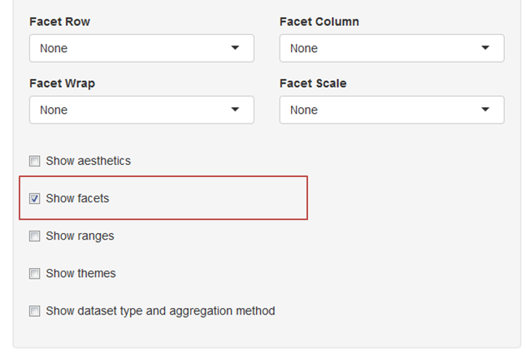
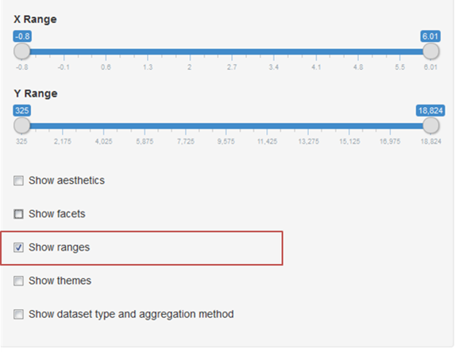
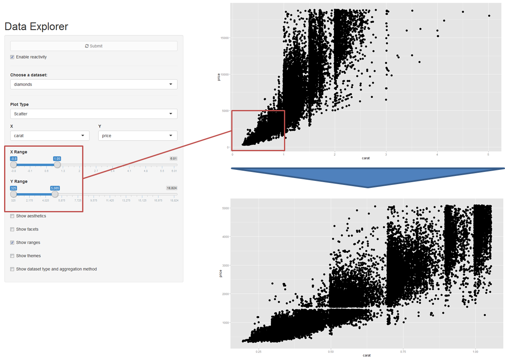
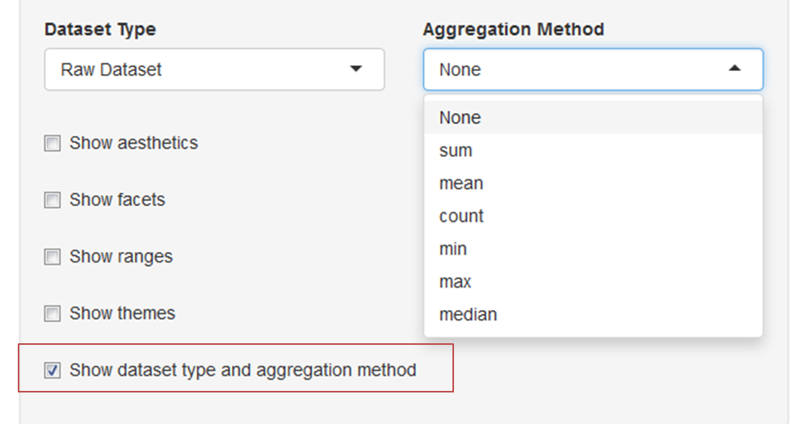

# raptR: Rapid And Pretty Things in R

## A Flexible Interface for Data Visualisation and Analysis

This vignette provides a guide to the raptR package. It describes the situations where the package can be applied and provides context in terms of package design and application. It also provides examples of the package in action.  

## Overview
raptR is an open source R package providing a graphical user interface for data exploration and visualisation. It is based on principles of visualization analysis by Tamara Munzner, and also acts as a wrapper for functionality implemented in the grammar of graphics for R, ggplot2.

Ggplot2 offers a wide array of marks and channels that constitute the building blocks for developing visual encodings, as well as a large selection of built-in visual idioms. However, users unfamiliar with the package may not have visibility of the options available to them, or find it challenging to express their envisioned design in their desired visual idiom.
 
raptR is designed to handle a spectrum of data visualisation needs ranging from visualising the raw values of individual variables through to fully aggregated, pivot-table style visualisations. Data volume and visual complexity is handled by the implementation of two approaches to handle visual complexity - faceting into multiple views, and reduction of items and attributes.

## Toolbar

The toolbar has four sections:

1. Loading data
2. Basic plotting (single visualisation)
3. Advanced visual encoding (aesthetics and themes, faceting, zoom-in)
4. Aggregation

The first two are shown in the screenshot below:

### 1. Loading data

To load data, either use a pre-loaded dataset from the 'Choose a dataset' dropdown, or click on the import tab and upload your own dataset using the buttons shown below.

### 2. Basic Plotting

To plot raw data, simply:

* Select a dataset
* Select a plot type (aka visual idiom)
* Select data attributes for the X axis and Y axis

Please refer to Appendix A further down this page for recommendations for the use of individual visual idioms.

### 3. Advanced visual encoding

#### 3.1 Aesthetics and Themes

Click on the 'Show aesthetics' box to explore a number of options to improve plot aesthetics, or the 'Show themes' box to customise plot label aesthetics.

'Show aesthetics' reveals the following controls:

* Additional attributes can be selected for encoding via other visual channels (colour, size and shape)
* Opacity and point size can be adjusted
* Jitter effects can be applied to facilitate visual analysis

Note: The 'jitter' effect is often used to enhance visual interpretability when dealing with a larger data sets with many overlapping data points. In this case, jittering would reveal the relative density of points around each overlapping data point.

If data appears cluttered or overly spaced out in the plot, check the 'Flip X and Y coordinates' box to explore swapping axes. 

'Show themes' reveals the following controls:

* Axis font labels and positioning can be adjusted
* Built-in themes can be used as a starting point for further customisation

#### 3.2 Faceting

Click on the 'Show facets' check box to display controls for presenting a multi-plot data visualisation. 

There are two faceting alternatives available to users:

* Use the facet row and/or facet column dropdowns to select variables to build multiple visualisations , OR 
* Use the facet wrap dropdown to direct the package to automatically select an optimal number of rows and columns that will seek to preserve the dimensions of the original plot.

The differences are shown below:

Optionally, the facet scale functionality allows the DE the freedom to re-scale the X-axis and/or Y-axis within each facet grid.

This is useful to improve visual clarity if the relative values of data attributes do not make good use of the visualisation space. However, caution should be taken as this may lead to misleading interpretations for the casual observer who misses the different scales used.

#### 3.3 Zoom-in

Click on the 'Show ranges' check box to display controls for zooming in on a subset of the plot. 

The two sliders can be dragged to restrict the range of the data shown. The visualisation area will scale so that the subsetted range will be shown over the full area.

An example of this control in action is shown below:

#### 4 Aggregation

To plot aggregated measures of data, check the 'Show dataset type and aggregation method' box.

Then select the desired aggregation method from the dropdown menu.

### Change and Submit vs. Dynamic Refreshing

A 'Submit' button and an 'Enable reactivity' checkbox at the bottom of the toolbar caters to user preferences. By default, the visualisation refreshes whenever there is a change to the dataset or any input widget. 

However, it may be advantageous at times to only generate the visualisation once multiple visualisation parameters have been tweaked (e.g. in the case of large datasets that take a while to render). In this case, the 'Enable reactivity' checkbox should be unchecked, and multiple changes can be made before clicking on the 'Submit' button.

### Appendix A: Guide to Visual Idiom Choices

Idiom:         | Scatterplots
-------------  | ------------ 
Data:          | Two quantitative value attributes   
Encoding:      | Express values with horizontal and vertical spatial position and point marks
Task:          | Find trends, outliers, distribution, correlation; locate clusters
Scale          | Hundreds of items

Idiom:         | Bar Charts
-------------  | ------------ 
Data:          | One quantitative value attributes, one categorical key attribute
Encoding:      | Express value attribute with aligned vertical position, separate key attribute with horizonal position
Task:          | Lookup and compare values
Scale          | Dozens to hundreds of levels

Idiom:         | Stacked Bar Charts
-------------  | ------------ 
Data:          | Multidimensional table: one quantitative value attributes, two categorical key attributes
Encoding:      | Bar with length-coded subcomponents of value attribute for each category of secondary key attribute. Separate bars by category of primary key attribute.
Task:          | Part-to-whole relationship, lookup values, find trends
Scale          | Main axis: Dozens to hundreds of levels. Stacks: Several to one dozen 

Idiom:         | Line Charts
-------------  | ------------ 
Data:          | One quantitative value attribute, one ordered key attribute
Encoding:      | Dot chart with connection marks between dots 
Task:          | Show trends
Scale          | Hundreds of levels

Idiom:         | Scatterplot Matrix (SPLOM)
-------------  | ------------ 
Data:          | Two quantitative value attributes for each plot, one categoric variable for row facet and one categoric variable for column facet
Encoding:      | Scatterplots in 2D matrix alignment
Task:          | Find correlation, trends, outliers
Scale          | Attributes: one dozen. Items: dozens to hundreds

